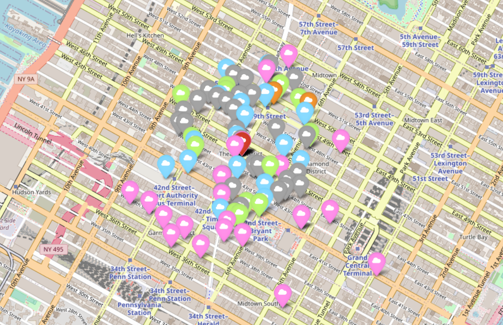

# Project | GeoSpartial Data Project

## Introduction

In this project we have recently created a new company in the `GAMING industry`. The company will have the following scheme:

- 20 Designers
- 5 UI/UX Engineers
- 10 Frontend Developers
- 15 Data Engineers
- 5 Backend Developers
- 20 Account Managers
- 1 Maintenance guy that loves basketball
- 10 Executives
- 1 CEO/President

Our goal is to place the **new company office** in the best place for the company to grow and that covers at least three of the following stakeholder's requirements:

- Designers like to go to design talks and share knowledge. There must be some nearby companies that also do design.
- 30% of the company have at least 1 child.
- Developers like to be near successful tech startups that have raised at least 1 Million dollars.
- Executives like Starbucks A LOT. Ensure there's a starbucks not to far.
- Account managers need to travel a lot
- All people in the company have between 25 and 40 years, give them some place to go to party.
- Nobody in the company likes to have companies with more than 10 years in a radius of 2 KM.
- The CEO is Vegan

## INPUT

## First Analysis: Decide the City of the new office

In order to decide what will be the new office city location we will analyze what is the city with more Gaming companies. After, we will see what is the city with more Designer companies, since this is one of the requirements of the stakeholders.

Result:

New York will be our city, because is the city with more Gaming companies and the second one with Design companies.

## Requirement: Nearby Design companies

- Designers like to go to design talks and share knowledge. There must be some nearby companies that also do design.

- Designers represents 23% of the total employees of the company.

- Filter all the DESIGN COMPANIES COORDINATES IN NEW YORK. Our new office needs to be nearby some of these coordinates.

- At the end, we have a range of 179 coordinates in New York to use as a reference to search for the new office. 

## Point of Reference: Our new office Coordinates

- From this data with 179 coordinates, let's pick one coordinate and check if fulfill some of the stakeholders requirement. If yes, this coordinate can be a good option for our new office. 

- See what is the top coordinate that repeat more often on the range of 179 coordinates.

Result:

- Coordinates: [-73.985506, 40.757929]

- Address: 159 West 45th Street, New York, NY 10036
  

## Confirming the Requirement: Nearby Design companies

- Check if our new coordinate have Design companies and specify the information.

Result:

- From our point of reference (-73.985506, 40.757929), we have 32 design companies in a 1KM radius. This fulfill one of the requirements.

## Requirement: Near the Airpot 
   
- Account managers need to travel a lot.
- Let's check the distance from our coordinates to the airport and see if is not so far away.

Result:

- Our coordinates [-73.985506, 40.757929] is less than 10KM away from the Airport La Guardia, which means that the executives won't take too long to get there and go on their business trips.
  
## SRC

## Foursquare

- Let's use the Foursquare API to get more information about the coordinate we want to launch our new office and check if it can cover more requirements.

## Requirement: Starbucks near

- Executives like Starbucks A LOT. Ensure there's a starbucks not to far.

- Executives represent 12% of the company members.

Result:

- From our point of reference we have 17 Starbucks in a 500m radius. The executives will be pretty happy.

## Requirement: Vegan Restaurants

-The CEO is Vegan.

- Let's see if our coordinate (-73.985506, 40.757929) have some vegan restaurants options for him.

Result:

- From our coordinate, we have 13 restaurants in the category: Vegetarian / Vegan Restaurant that will keep our CEO satisfied.

## Requirement: Party

- All people in the company have between 25 and 40 years, give them some place to go to party.

Result:

- From our coordinate, we have 30 places in the category: Nightlife Spot. Let the party begin!

## Requirement: Child Care Service

- 30% of the company have at least 1 child.

- Check if we have any child care service in a 1KM radius.

Result:

- We have two child service care near the office. It might not be a lot, but at least give some options for the parents that work in our company.

## Conclusion:

- Our coordinate (-73.985506, 40.757929) fulfill most of the requirements of the stakeholders, which indicates that is a good suggestion for the new office. 

## OUTPUT

## Visualize the results in a Map:

- Create a dataframe with all the coordenates of the requirements.

- Import this dataframe in the file Folium.

- Create a Folium map to visualize the new office location.

Legend:
- New office: Red
- Starbucks: Blue
- Design companies: Pink
- Nightlife Spot: Gray
- Vegan Restaurants: Green
- Child service care: Orange
- Airport: Purple

